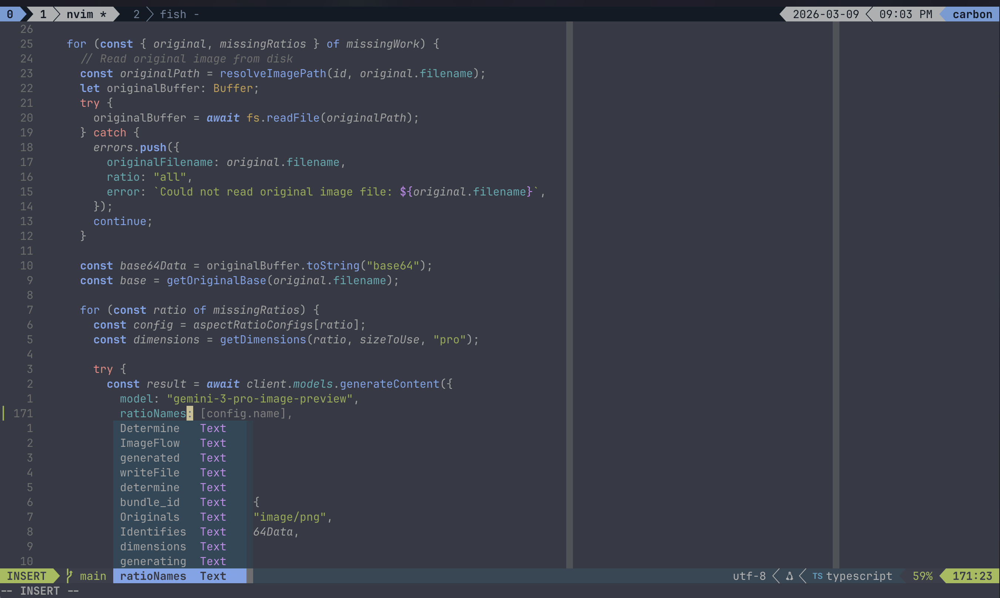
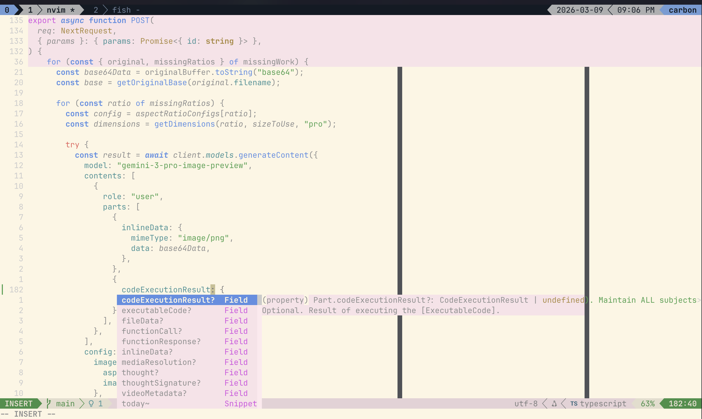

# isocon

A Neovim colorscheme where every syntax color has the same WCAG contrast ratio against the background, and hues are evenly spaced in perceptual color space.





## Installation

With [lazy.nvim](https://github.com/folke/lazy.nvim):

```lua
{ dir = '~/path/to/isocon' }
```

## Usage

```lua
vim.cmd('colorscheme isocon')
```

The colorscheme auto-detects `vim.o.background` and applies the appropriate defaults. You can also call `setup()` to override specific values:

```lua
require('isocon').setup({
  background   = '#282c34', -- any hex color; dark/light auto-detected
  contrast     = 5.0,       -- WCAG contrast ratio (AA = 4.5, AAA = 7.0)
  bright_boost = 1.3,       -- chroma multiplier for bright terminal colors
  hues = {                  -- OKLCH hue angles in degrees (all optional)
    red     = 25,
    green   = 150,
    yellow  = 85,
    blue    = 260,
    magenta = 305,
    cyan    = 200,
  },
})
vim.cmd('colorscheme isocon')
```

### Defaults

Defaults are chosen based on `vim.o.background`:

| Option        | dark      | light     |
|---------------|-----------|-----------|
| `background`  | `#282c34` | `#fdf6e3` |
| `contrast`    | `5.0`     | `3.0`     |
| `bright_boost`| `1.3`     | `1.2`     |
| `green` hue   | `150°`    | `150°`    |
| `magenta` hue | `305°`    | `305°`    |

### Printing terminal colors

To get the 16 ANSI terminal color values for your current config (useful for configuring your terminal emulator):

```lua
require('isocon').print_colors()
```

Or as a command:

```vim
:lua require('isocon').print_colors()
```

## How it works

Every foreground color is generated from the background using the same three-step process:

**1. Target luminance** — given a background luminance `Y_bg` and desired contrast ratio `CR`, solve for the foreground luminance:
- Dark background: `Y_fg = CR × (Y_bg + 0.05) − 0.05`
- Light background: `Y_fg = (Y_bg + 0.05) / CR − 0.05`

**2. Find lightness** — binary-search the Oklab `L` value such that the color at `(L, C, H)` hits `Y_fg` exactly.

**3. Max chroma** — binary-search for the highest chroma that keeps the color inside the sRGB gamut. Normal colors use 75% of that; bright variants use 100% (or `normal × bright_boost`, whichever is smaller).

The six hues are fixed by default in OKLCH (all overridable via `hues`):

| Color   | Angle | Notes |
|---------|------:|-------|
| red     |  25°  | Warm red — lower drifts pink, higher drifts orange |
| yellow  |  85°  | Pure yellow — lower is orange, higher is yellow-green |
| green   | 150°  | Mid green — lower is lime, higher is teal |
| cyan    | 200°  | Teal-cyan — lower merges with green, higher drifts blue |
| blue    | 260°  | Prototypical blue — lower is violet, higher is indigo |
| magenta | 305°  | Clear magenta — lower is purple, higher is hot pink |

These are **not** evenly spaced, because colors are not evenly distributed around the perceptual wheel. Yellow and green dominate a large arc (~85°–180°, nearly a third of the wheel) while red and magenta occupy a much narrower band (~0°–40° and 300°–360°). OKLCH partially corrects for this compared to HSL, but the unevenness remains — so the hues are placed where each color is most unambiguously recognizable, not at equal intervals.

The result: every color you see in your editor has the same contrast against the background, and colors are as saturated as the gamut allows at that lightness.
